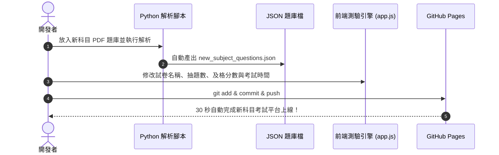

# 線上模擬考試系統 - 完整全端開發與部署實戰手冊
> **專案範例**：人身保險業務員資格測驗模擬考試測試平台  
> **線上展示**：[https://zjh0511.github.io/Hao-ATS/](https://zjh0511.github.io/Hao-ATS/)  
> **開源儲存庫**：[https://github.com/zjh0511/Hao-ATS](https://github.com/zjh0511/Hao-ATS)  
> **文件用途**：本手冊詳細記錄從「原始 PDF 題庫解析」到「現代化純前端測驗引擎開發」，再到「GitHub Pages 免費一鍵上架託管」的完整實作流程，可作為日後開發任何證照、公職、學測等模擬考試系統的標準開發範本（Template / SOP）。

---

## 目錄
1. [專案概覽與核心架構](#1-專案概覽與核心架構)
2. [技術選型與設計理念](#2-技術選型與設計理念)
3. [階段一：題庫自動化萃取與正規化 (Data Pipeline)](#3-階段一題庫自動化萃取與正規化-data-pipeline)
4. [階段二：前端介面設計與條列式選單 (UI/UX Design)](#4-階段二前端介面設計與條列式選單-uiux-design)
5. [階段三：核心測驗引擎與計分系統實作 (Exam Engine)](#5-階段三核心測驗引擎與計分系統實作-exam-engine)
6. [階段四：練習紀錄與 AI 助教模組整合](#6-階段四練習紀錄與-ai-助教模組整合)
7. [階段五：Git 版本控制與 GitHub Pages 上架教學](#7-階段五git-版本控制與-github-pages-上架教學)
8. [未來開發新考試科目的標準 SOP (SOP for New Exam)](#8-未來開發新考試科目的標準-sop-sop-for-new-exam)
9. [專案目錄結構清單](#9-專案目錄結構清單)

---

## 1. 專案概覽與核心架構

本專案旨在打造一個**無須後端伺服器、極速載入、零維護成本、跨裝置響應（PC / Tablet / Mobile）**的專業線上模擬考試系統。

### 平台五大核心功能模組：
1. **【專業科目】保險法規**：提供固定試卷（A 卷 1~100 題、B 卷 101~200 題、C 卷 201~300 題）與 100 題隨機模擬測驗，限時 80 分鐘，70 分及格。
2. **【專業科目】保險實務**：提供固定試卷（A 卷 1~50 題、B 卷 51~100 題、C 卷 101~150 題）與 50 題隨機模擬測驗，限時 60 分鐘，每題 2 分，70 分及格。
3. **【共同科目】金融市場常識與職業道德**：金融市場常識與職業道德各隨機抽 50 題（共 100 題），限時 60 分鐘，70 分及格；並提供官方題庫 PDF 下載/線上預覽。
4. **AI考照輔導小助教**：串接外部 ChatGPT 專屬考照 GPTs，提供 24 小時法規名詞與計算題解惑。
5. **練習紀錄**：歷次測驗分數、花費時間、答題狀況自動保存在瀏覽器本地端，支援錯題複習與詳細解析重現。

```mermaid
flowchart TD
    User([考生 / 使用者]) --> WebApp[靜態前端入口 index.html]
    WebApp --> CoreEngine[測驗核心引擎 app.js]
    WebApp --> DesignSystem[視覺樣式系統 index.css]
    
    subgraph DataLayer [資料層 Data Layer]
        Law[保險法規.json (300題)]
        Practice[保險實務.json (160題)]
        Finance[金融常識.json (504題)]
        Ethics[職業道德.json (616題)]
    end
    
    subgraph StorageLayer [持久化層 Local Storage]
        History[(歷次考試分數 & 錯題紀錄)]
    end
    
    CoreEngine --> DataLayer
    CoreEngine <--> StorageLayer
    CoreEngine --> ResultView[成績結算 & 錯題詳細解析]
    CoreEngine --> AIModal[AI 考照小助教]
```

---

## 2. 技術選型與設計理念

### 2.1 為什麼選擇「純前端靜態架構 (Static SPA)」？
* **零伺服器成本**：無須購買雲端虛擬主機（VPS）或資料庫，直接託管於 GitHub Pages、Cloudflare Pages 或 Vercel。
* **高併發與極速響應**：所有題目 JSON 資料於初次載入時非同步快取至記憶體，交卷、切換題目、標記毫秒級響應，不會受網路延遲影響。
* **注重隱私與離線可用**：使用者的作答資料與成績全部儲存於本地 `localStorage`，不蒐集考生個人資料。

### 2.2 核心技術棧
| 元件 | 技術 | 說明 |
| :--- | :--- | :--- |
| **結構 (Structure)** | HTML5 語意化標籤 | SEO 友善，支援 Modal、Iframe、Progress Bar |
| **邏輯 (Logic)** | Modern ES6+ JavaScript | 物件導向狀態管理 (`AppState`)、非同步資料載入、Fisher-Yates 隨機抽題、計時器、鍵盤事件監聽 |
| **樣式 (Styling)** | Vanilla CSS (CSS3) | 雙主題（深色/淺色）切換、Glassmorphism 毛玻璃特效、條列式清單、Flexbox/Grid 自適應佈局 |
| **資料處理** | Python 3 + PyMuPDF (`fitz`) | 用於解析 PDF 題庫並自動轉換為結構化 JSON 檔案 |
| **部署 (Hosting)** | GitHub Pages | 免費自動化託管與 CDN 加速 |

---

## 3. 階段一：題庫自動化萃取與正規化 (Data Pipeline)

在任何考試系統中，**高品質且結構精確的題庫資料**是成功的基石。

### 3.1 題庫原始格式與解析挑戰
* **保險法規 / 保險實務 PDF**：採多欄表格編排（包含：`題號`、`問題描述`、`選項 (A)(B)(C)(D)`、`正解`、`解析說明`）。在純文字抽取時，多欄文字容易上下錯位或黏合。
* **金融市場常識 / 職業道德 PDF**：採行條列格式（`(答案) 題號 題目 (1)選項 (2)選項 (3)選項 (4)選項`），部分考題內容跨越分頁斷裂。

### 3.2 解決方案：PyMuPDF `find_tables()` 與智慧正則剖析
我們使用 Python 編寫 `build_question_banks.py` 處理萃取：

```python
import fitz  # PyMuPDF
import json
import re

def parse_with_tables(pdf_path):
    doc = fitz.open(pdf_path)
    questions = []
    
    for page in doc:
        # 使用 PyMuPDF 內建之表格辨識器，依據格線精準分欄
        for tab in page.find_tables():
            rows = tab.extract()
            for r in rows:
                if not r or len(r) < 4:
                    continue
                q_id_str = str(r[0]).strip() if r[0] is not None else ""
                if not q_id_str.isdigit():
                    continue
                
                q_id = int(q_id_str)
                q_text = str(r[1]).strip() if r[1] is not None else ""
                opt_str = str(r[2]).strip() if r[2] is not None else ""
                ans_str = str(r[3]).strip() if r[3] is not None else ""
                exp_str = str(r[4]).strip() if len(r) > 4 and r[4] is not None else ""
                
                # 依 (A)、(B)、(C)、(D) 拆分 4 個選項
                opt_matches = list(re.finditer(r'\(A\)\s*|\(B\)\s*|\(C\)\s*|\(D\)\s*', opt_str))
                options = ["", "", "", ""]
                if len(opt_matches) >= 4:
                    for opt_i in range(4):
                        s = opt_matches[opt_i].end()
                        e = opt_matches[opt_i+1].start() if opt_i + 1 < len(opt_matches) else len(opt_str)
                        options[opt_i] = opt_str[s:e].strip()
                
                questions.append({
                    'id': q_id,
                    'question': re.sub(r'\s*\n\s*', ' ', q_text).strip(),
                    'options': [re.sub(r'\s*\n\s*', ' ', opt).strip() for opt in options],
                    'answer': ans_str,
                    'explanation': exp_str
                })
    return questions
```

### 3.3 標準 JSON 資料結構 (JSON Schema)
所有科目最終統一輸出為以下標準格式，供前端引擎使用：

```json
[
  {
    "id": 1,
    "question": "要保人訂立契約須",
    "options": [
      "具有行為能力",
      "不須具有行為能力",
      "限制行為能力於限制原因消滅後自己承認",
      "僅選項第1、3為是。"
    ],
    "answer": "D",
    "explanation": "所謂行為能力，即指能獨立為有效法律行為的能力，一般成年人..."
  }
]
```

---

## 4. 階段二：前端介面設計與條列式選單 (UI/UX Design)

### 4.1 首頁條列式選單 (Vertical Row-by-Row Layout)
根據使用者體驗優化，將傳統的多欄卡片改為**由上而下、一行一行呈現的條列式橫向卡片**：

```css
/* 條列式卡片容器 */
.category-grid {
  display: flex;
  flex-direction: column;
  gap: 1.15rem;
}

/* 橫向單行卡片 */
.category-card {
  background: var(--card-bg);
  border: 1px solid var(--border-color);
  border-radius: var(--radius-md);
  padding: 1.25rem 1.6rem;
  cursor: pointer;
  transition: all 0.2s ease;
  display: flex;
  flex-direction: row;
  align-items: center;
  gap: 1.35rem;
}

.category-card:hover {
  transform: translateX(6px); /* 懸停微右滑動畫 */
  border-color: var(--accent-primary);
  box-shadow: 0 8px 20px -4px rgba(0, 0, 0, 0.3);
}
```

### 4.2 雙色主題系統 (Dark / Light Theme)
透過 CSS 變數定義設計權杖（Design Tokens），並提供一鍵切換按鈕：
* **深色主題 (預設)**：`#0f172a` (深岩藍底色) + `#1e293b` (卡片底色) + `#3b82f6` (科技藍重點色)
* **淺色主題**：`#f1f5f9` (明亮灰底色) + `#ffffff` (純白卡片)
* **及格狀態色**：`#10b981` (翠綠色)
* **不及格/錯誤色**：`#ef4444` (緋紅色)
* **標記題/倒數警示色**：`#f59e0b` (琥珀黃)

---

## 5. 階段三：核心測驗引擎與計分系統實作 (Exam Engine)

所有測驗邏輯封裝在 `app.js` 的 `AppEngine` 物件中。

### 5.1 隨機抽題演算法 (Fisher-Yates Shuffle)
保證每一次模擬測驗抽出的考題完全獨立且均勻分佈：
```javascript
shuffleArray(arr) {
  const copy = [...arr];
  for (let i = copy.length - 1; i > 0; i--) {
    const j = Math.floor(Math.random() * (i + 1));
    [copy[i], copy[j]] = [copy[j], copy[i]];
  }
  return copy;
}
```

### 5.2 倒數計時器與自動交卷 (Auto-Submit Timer)
```javascript
startTimer() {
  this.stopTimer();
  const timerEl = document.getElementById('timer-text');
  const badgeEl = document.getElementById('exam-timer');

  const updateDisplay = () => {
    const mins = Math.floor(AppState.timeRemainingSeconds / 60);
    const secs = AppState.timeRemainingSeconds % 60;
    timerEl.innerText = `${mins.toString().padStart(2, '0')}:${secs.toString().padStart(2, '0')}`;

    // 時間小於 5 分鐘變為危險紅光閃爍
    if (AppState.timeRemainingSeconds <= 300) {
      badgeEl.className = 'timer-badge danger';
    } else if (AppState.timeRemainingSeconds <= AppState.currentExam.timeMins * 30) {
      badgeEl.className = 'timer-badge warning';
    } else {
      badgeEl.className = 'timer-badge';
    }
  };

  AppState.timerInterval = setInterval(() => {
    AppState.timeRemainingSeconds--;
    AppState.timeSpentSeconds++;
    updateDisplay();

    if (AppState.timeRemainingSeconds <= 0) {
      this.stopTimer();
      alert('⏰ 考試時間已到！系統為您自動完成交卷。');
      this.submitExam(true);
    }
  }, 1000);
}
```

### 5.3 答題地圖網格 (Question Palette)
* **顏色狀態**：灰（未作答）、藍（已作答）、黃（標記為不確定）、白色發光外框（目前題號）。
* 點擊任意題號可無縫瞬間跳題。
* 支援鍵盤快速鍵：`1~4` / `A~D` 選擇答案、`←/→` 切換題目、`F` 標記本題。

### 5.4 智能閱卷與成績解析過濾 (Score & Review System)
* **分數計算**：依科目規則計算總分（法規 1分/題、實務 2分/題、共同科目 1分/題），70 分判定及格。
* **三合一解析篩選器**：
  * `全部題目`：顯示整份考卷全部題目的正解與解析。
  * `僅看錯題`：快速過濾出答錯或漏答的題目，精準訂正。
  * `僅標記題`：針對考試時有打星號的題目進行複習。

---

## 6. 階段四：練習紀錄與 AI 助教模組整合

### 6.1 本地儲存練習紀錄 (LocalStorage)
交卷後將本次考試完整中繼資料寫入 `localStorage`：
```javascript
const record = {
  id: 'REC_' + Date.now(),
  dateStr: new Date().toLocaleString('zh-TW', { hour12: false }),
  examTitle: exam.title,
  score: totalScore,
  passed: totalScore >= 70,
  correctCount,
  wrongCount,
  unansweredCount,
  totalQuestions: exam.questions.length,
  timeSpentSeconds: AppState.timeSpentSeconds,
  detailedResults // 儲存該次測驗所有題目與使用者選擇，便於日後重播檢視
};
AppState.history.unshift(record);
localStorage.setItem('ATS_EXAM_HISTORY_V1', JSON.stringify(AppState.history));
```

### 6.2 AI 考照小助教整合
在主選單第 4 項加入 AI 考照輔導小助教，點擊以安全屬性新開分頁導向專屬 ChatGPT 考照機器人：
```html
<div class="category-card ai-card" onclick="window.open('https://reurl.cc/AMl5j3', '_blank', 'noopener,noreferrer')">
  <div class="card-badge ai-badge">AI 智慧輔導</div>
  ...
</div>
```

---

## 7. 階段五：Git 版本控制與 GitHub Pages 上架教學

### 7.1 本地 Git 專案初始化與提交
```bash
# 1. 進入專案根目錄
cd /d/Hao+App/ATS

# 2. 初始化 Git 儲存庫
git init

# 3. 設定本地 Git 使用者資訊（若全域尚未設定）
git config user.name "Your Name"
git config user.email "your-email@example.com"

# 4. 加入檔案並進行初次提交
git add .
git commit -m "Initial commit: 線上模擬考試平台完整系統"
```

### 7.2 推送至遠端 GitHub 儲存庫
```bash
# 關聯遠端 GitHub Repository
git remote add origin https://github.com/zjh0511/Hao-ATS.git

# 設定主分支為 main 並推送
git branch -M main
git push -u origin main
```

### 7.3 GitHub Pages 免費上架步驟（超重要 100% 成功關鍵）
1. 開啟您的 GitHub 專案頁面，點選右上角 **`Settings` (設定)**。
2. 在左側選單點選 **`Pages`**。
3. 在 **Build and deployment** 區塊：
   * **Source** 選擇：👉 **`Deploy from a branch`**
   * **Branch** 第一個選單選：👉 **`main`**
   * 第二個資料夾選單保持：👉 **`/ (root)`**
4. 點選藍色 **`Save`** 按鈕。
5. 等待約 **20~30 秒**，在上方看到 `Your site is live at https://<username>.github.io/<repo>/` 即代表大功告成！

### 7.4 常見錯誤排查：為什麼開起來會出現 404？
* **原因一**：剛點完 Save，GitHub 後台的 `pages-build-deployment` 工作流尚在構建中，通常需要等待 20~60 秒。
* **原因二**：倉庫根目錄下缺少 `index.html`（檔案名稱必須全部小寫 `index.html`）。
* **原因三**：自訂了 GitHub Actions（例如 `.github/workflows/static.yml`）但未開啟 Actions 寫入 Pages 權限。**解法**：純靜態網站請直接在 Settings -> Pages 使用 `Deploy from a branch` 即可，最穩定且零出錯。

---

## 8. 未來開發新考試科目的標準 SOP (SOP for New Exam)

若未來您需要開發新的考試科目（例如：信託業務員、證券商業務員、理財規劃人員、公職高考等），只需依照以下 4 個步驟：



### Step 1. 準備 PDF 題庫並執行解析腳本
1. 將新科目的官方 PDF 放入 `題庫/` 資料夾。
2. 執行 `python build_question_banks.py` 產出對應的 `xxx_questions.json`。
3. 檢查產出的 JSON 是否具備題目、4 個選項、正確答案與解析。

### Step 2. 修改前端設定與試卷規則 (`app.js`)
在 `startExam(typeCode)` 函式中新增新科目的考試規則：
```javascript
if (typeCode === 'new_subject_A') {
  title = '【新科目】測驗_A卷';
  questions = AppState.newSubjectQuestions.slice(0, 50); // 題數
  timeMins = 60;       // 考試時間
  pointsPerQ = 2;      // 每題配分
  passScore = 70;      // 及格標準
}
```

### Step 3. 更新首頁選單項目 (`index.html`)
在 `.category-grid` 中複製並新增卡片項目與對應點擊事件。

### Step 4. 推送至 GitHub 發布
```bash
git add .
git commit -m "feat: 新增 xxx 考試科目題庫與測驗試卷"
git push origin main
```

---

## 9. 專案目錄結構清單

```text
d:\Hao+App\ATS\
│
├── index.html                        # 前端主頁面結構 (SPA 單頁應用)
├── index.css                         # 樣式表 (深/淺色雙主題、條列式清單佈局)
├── app.js                            # 核心測驗引擎 (計時、抽題、評分、紀錄)
│
├── law_questions.json                # 保險法規 300 題完整題庫 (含解析)
├── practice_questions.json           # 保險實務 160 題完整題庫 (含解析)
├── finance_questions.json            # 金融市場常識 504 題完整題庫
├── ethics_questions.json             # 職業道德 616 題完整題庫
│
├── build_question_banks.py           # 題庫自動化剖析與資料正規化腳本
├── .gitignore                        # Git 忽略設定
├── EXAM_PLATFORM_DEVELOPMENT_MANUAL.md # 本開發與上架實戰手冊
│
└── 題庫/                             # 原始 PDF 官方題庫目錄
    ├── 人身保險業務員資格測驗_保險法規.pdf
    ├── 人身保險業務員資格測驗_保險實務.pdf
    ├── 金融市場常識-113.pdf
    └── 職業道德-113.pdf
```

---
*本文件由 Antigravity 團隊編製，適用於現代化線上測驗平台之標準化複製與快速開發。*
